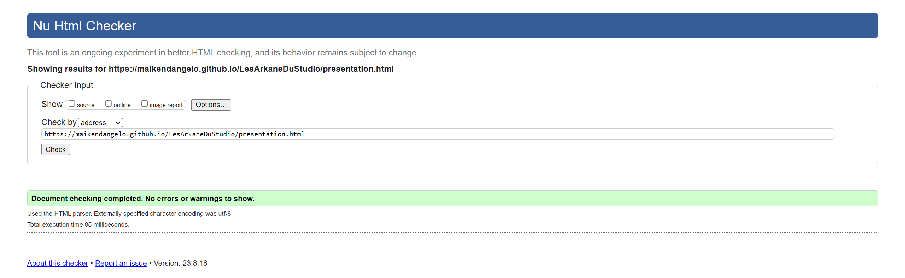
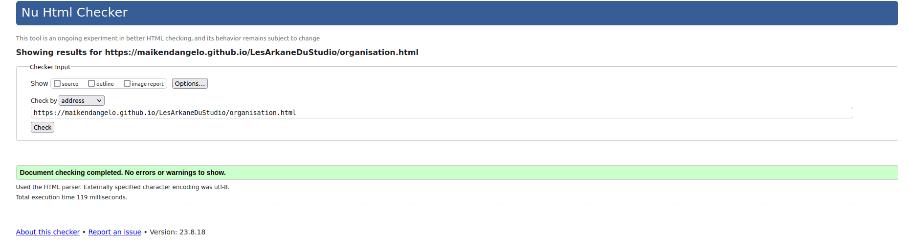
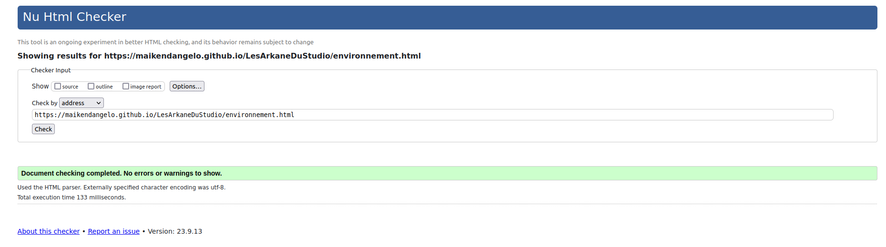

# LesArkaneDuStudio

## Qui sommes nous ?

Nous sommes une équipe de 5 étudiants en BUT Informatique à l'IUT Nord Franche Comté de Belfort.  
  
Notre équipe est composée de :  
[Mehdi BEN SMAIL](mailto:mehdi.ben_smail@edu.univ-fcomte.fr?subject=SAE_1_05_06),  
[Valentin BELIARD](mailto:valentin.beliard@edu.univ-fcomte.fr?subject=SAE_1_05_06),  
[Quentin BELHADJ](mailto:quentin.belhadj@edu.univ-fcomte.fr?subject=SAE_1_05_06),  
[Elena BERNARD](mailto:adrien.bernard@edu.univ-fcomte.fr?subject=SAE_1_05_06)
et [Maïken D'ANGELO](mailto:maiken.d_angelo@edu.univ-fcomte.fr?subject=SAE_1_05_06), notre référente.  
  
Pour nous contacter, adressez-vous à notre référente à cette adresse e-mail : [maiken.d_angelo@edu.univ-fcomte.fr](mailto:maiken.d_angelo@edu.univ-fcomte.fr?subject=SAE_1_05_06)  

## Que faisons-nous ?

Nous avons pour projet de créer un site web présentant économiquement l'entreprise française Arkane Studios, studio renommé de jeux vidéo.  
En plus de cela nous rédigerons un rapport, qui sera disponible sur le site web pour téléchargement.  
  
Vous pouvez accéder à notre site web grâce au lien suivant: https://maikendangelo.github.io/LesArkaneDuStudio/  

Ce site web est créé en HTML, CSS et Javascript dans le cadre de la SAE 05-06 à l'Institut Universitaire de Technologie de Belfort-Montbéliard. Notre projet à pour vocation de servir de vitrine pour l'entreprise en présentant ses activités, son organisation et son historique, en faisant une emphase sur les aspects économiques notamment.  

## Choix de conception

En ce qui concerne le design et la conception du site, nous nous sommes grandement inspirés du site web officiel de Arkane Studios, disponible [ici](https://www.arkane-studios.com/fr).

## Page d'accueil

Auteur : Tout le monde  

Vérification W3C : [Lien vers la vérification]()  
Capture d'écran:   

## Page Présentation

Auteur : Quentin Belhadj  

Vérification W3C : [Lien vers la vérification](https://validator.w3.org/nu/?doc=https%3A%2F%2Fmaikendangelo.github.io%2FLesArkaneDuStudio%2Fpresentation.html)  
Capture d'écran:   

## Page Activités

Auteur : Valentin Beliard  

Vérification W3C : [Lien vers la vérification](https://validator.w3.org/nu/?showsource=yes&useragent=Validator.nu%2FLV+http%3A%2F%2Fvalidator.w3.org%2Fservices&acceptlanguage=&doc=https%3A%2F%2Fmaikendangelo.github.io%2FLesArkaneDuStudio%2Fservices.html)  
Capture d'écran:   

## Page Organisation

Auteur : Mehdi Ben Smail  

Vérification W3C : [Lien vers la vérification](https://validator.w3.org/nu/?doc=https%3A%2F%2Fmaikendangelo.github.io%2FLesArkaneDuStudio%2Forganisation.html)  
Capture d'écran:   

## Page Environnement de travail

Autrice : Maïken D'Angelo  

Vérification W3C : [Lien vers la vérification](https://validator.w3.org/nu/?useragent=Validator.nu%2FLV+http%3A%2F%2Fvalidator.w3.org%2Fservices&acceptlanguage=&doc=https%3A%2F%2Fmaikendangelo.github.io%2FLesArkaneDuStudio%2Fenvironnement.html)  
Capture d'écran:   

## Page Point économique

Autrice : Elena Bernard  

Vérification W3C : [Lien vers la vérification](https://validator.w3.org/nu/?doc=https%3A%2F%2Fmaikendangelo.github.io%2FLesArkaneDuStudio%2Fpointeconomique.html)  
Capture d'écran:   

## Page Crédits

Auteurs : Tout le monde 

Vérification W3C : [Lien vers la vérification]()  
Capture d'écran:   

## Remerciements

Nous tenons tout particulièrement à remercier nos proches et amis qui nous ont aidés et soutenus tout au long de ce projet.  
Un grand merci à Alexia D., Maude L. et Jean-Baptiste F.
